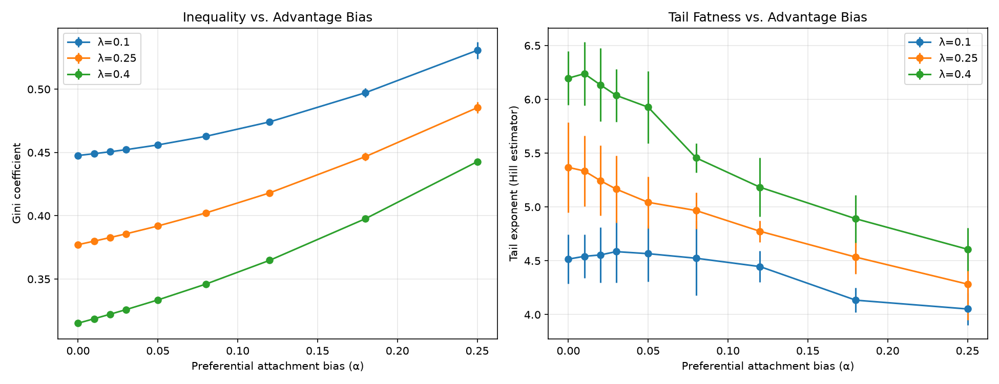
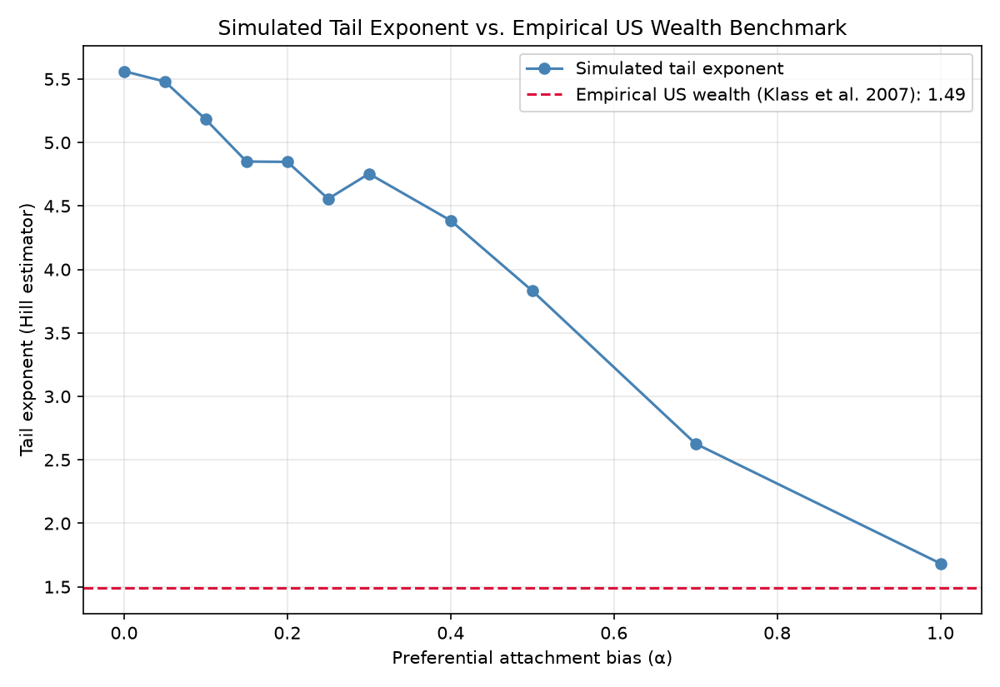

# Econophysics Statistical Mechanics Framework

A calibration engine that applies statistical mechanics to asset exchange dynamics — modeling
an economy as a closed thermodynamic system where currency units behave like energy quanta
colliding between particles.

## Core Idea

Purely randomized wealth exchange, under strict conservation laws, converges on a
Boltzmann-Gibbs (exponential) distribution — the same math that describes energy distribution
among gas molecules. But real-world wealth data shows heavy power-law tails, not clean
exponentials. This project shows why: introducing a systemic advantage for wealthier agents
breaks the thermal equilibrium and reproduces those empirical power-law tails.

## Theoretical Methodology

**Phase I — Thermal Analogue (Conservation Laws)**
Two randomly chosen agents exchange wealth via a kinetic-collision model. Total wealth is
strictly conserved (first law of thermodynamics). A savings propensity λ controls how much
capital is "active" in each transaction:

ΔW = (1 - λ)(w_i + w_j)

This converges to the equilibrium distribution:

P(w) = (1/T) × e^(-w/T)

**Phase II — Preferential Attachment (Asymmetric Advantage)**
A bias parameter α gives wealthier agents a systemic edge in transaction outcomes, scaled by a
bounded tanh function (to avoid runaway overflow at large wealth differentials):

Bias = α × tanh((w_rich / w_poor) - 1)

This structural break produces the heavy-tailed, power-law wealth distributions seen in real
economic data.

## Files

| File | Purpose | Output |
|---|---|---|
| `model.py` | Runs the dual-stage transaction loop (pure physics vs. advantage scaling) | `asymmetric_plot.png` |
| `validate.py` | Runs 200,000 transactions and benchmarks simulated wealth distribution against an empirical baseline | `validation_plot.png` |

## Installation & Execution

```bash
pip install numpy matplotlib
python model.py
python validate.py
```

## Results: Parameter Sweep

To understand how savings behavior and preferential attachment interact, I ran the
simulation across a grid of λ (savings propensity) and α (advantage bias) values,
measuring the resulting Gini coefficient and tail exponent.



**Findings:**
- Inequality increases smoothly and continuously with α — this is a gradual crossover,
  not a sharp phase transition.
- Savings propensity substantially dampens how much a given advantage bias translates
  into realized inequality: at λ=0.4, even the highest tested α only reached a Gini of
  0.44, compared to 0.53 at λ=0.1 for the same α.
- This suggests savings behavior is at least as important a lever on long-run inequality
  as the strength of systemic advantage itself.

- **Dynamic savings propensities:** make λ vary by wealth, so low-income agents save less than
  wealthy agents — closer to real consumption behavior.
- **Taxation & redistribution:** add a tax on transactions feeding a public pool redistributed
  to the population, to study its effect on the Gini coefficient.

  ## Validation Against Real-World Wealth Data

Published empirical estimates put the Pareto tail exponent of US wealth at ~1.4–1.5
(Klass et al. 2007 report 1.49 using Forbes 400 and survey data; more recent work using
tax records finds a similar ~1.4). I compared this benchmark against my simulation's tail
exponent across a range of α values.


**Findings:**
- At low α, the simulation's tail exponent (~5.5) is far thinner than real-world wealth
  concentration — pure random exchange plus weak advantage cannot reproduce observed inequality.
- The simulation only approaches the empirical benchmark (tail exponent ≈1.68 vs. real 1.49)
  at a strong advantage bias (α≈1.0) — several times larger than initially tested values.
- This suggests that matching real-world wealth concentration requires substantially stronger
  compounding advantage than baseline preferential-attachment assumptions, a finding consistent
  with literature noting that simple exchange models tend to understate top-tail concentration
  without additional mechanisms (e.g., inheritance, capital income reinvestment).

**Limitations:** This model captures only pairwise transaction dynamics and does not include
inherited wealth, differential asset returns, or taxation — all known drivers of real-world
tail concentration. The Hill estimator is also sensitive to the choice of top-fraction cutoff
(5% used here) and sample size.
